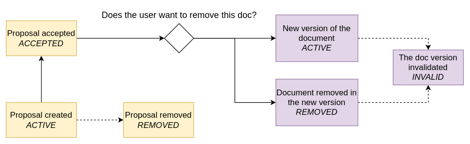
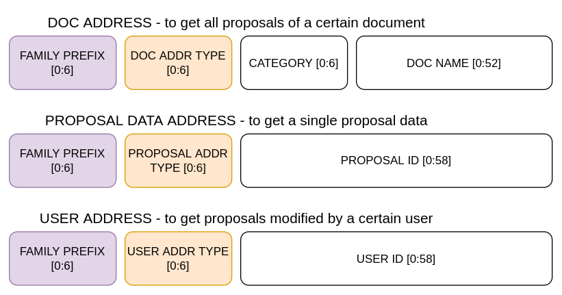
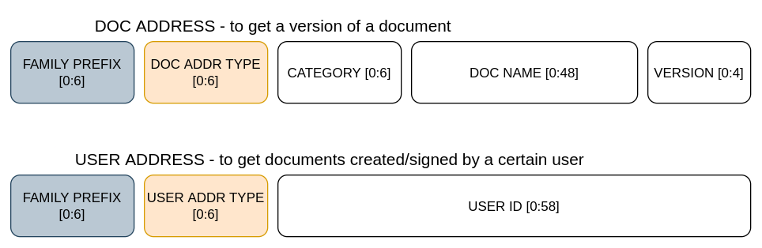
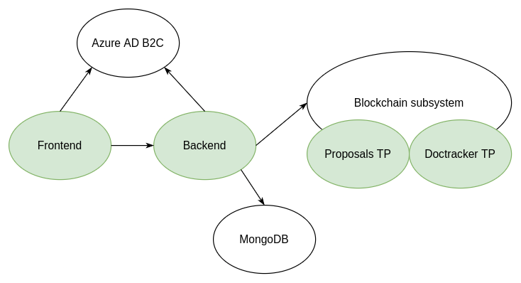

# Organizational Documents Management using Blockchain technology

Each organization needs a way to store and update its documents.
And in the organization world, new documents usually have to
be reviewed and signed by its members, before they get accepted.

This application serves as a backend of a system managing documents.
It focuses on two main concepts: proposals and documents. 

A document is an accepted version of a proposal. A document can come in several versions,
each might be created by a different person. It is uniquely identified by its name and category.
A user can't create the document directly, only through a proposal and the signing process.

A proposal however can be created by anyone. It needs to include the document name it refers to.
If the document already exists, when the proposal is accepted,
it is added under the same name and category with the next version number.



## Blockchain

By using the blockchain technology an organization can make sure that nobody can
modify the existing documents - change their content, remove, etc.

Submitted documents have their content stored in the off-chain database and then
their document related information together with the content hash are submitted to the blockchain.

The application uses the Hyperledger Sawtooth technology. The blockchain needs to be run with the two Transaction Families: Proposals TF and DocTracker TF, actively processing the requests. Both are written in pyton.

### Proposal TF

This transaction family creates new proposals on the blockchain. Also is responsible for the voting (document signing) process and accepting the documents when the vote threshold is reached. The threshold is read from the blockchain settings.

The family uses 3 types of addresses ilustrated on the picture below. Thanks to that a user can perform queries by the proposal ID, proposal name and category, by the proposal author or signer. 



On the proposal acceptance an 'proposal_accepted' event is generated.

### DocTracker TF

The DocTracker TF processes accepted documents. Just like the Proposal TF, more than one address types are used. The user can query by the certain document version (including getting all the versions of a certain document), by the document author or a signer.




## User management

The organization users are managed by the external service Azure AD B2C by administrators. The application retrieves the user data from this service using its client credentials. Also updates them with generated public and private keys if missing, which are used to sign the blockchain transactions.

# How to run?

## Azure AD B2C tenant

 - application registered
 - exposed APIs
     - docs.read
     - docs.write
     - docs.sign
 - API permissions
     - Microsoft Graph: `User.ReadWrite.All`
 - client secret created
 - created the application user account

## Environment

```
cp backend/.env.example backend/.env
```
Adjust the backend service environment variables, especially these related to Azure service (prepended with MS_).
Use the user ID of the application account in APP_USER_ID.

Make sure that the PORT number is set.

## Starting the system
```
docker-compose up
```
After stopping the system, restart it with:
```
docker-compose down && docker-compose up
```

# Architecture



This is the backend application of the system. 

## Backend HTTP server

### Served requests

PUT `/api/proposals/{docName}` - create a new proposal  

POST `/api/proposals/{proposalID}` - sign a proposal  

GET `/api/proposals` - get proposals  
GET `/api/docs` - get accepted documents by author/signer  
GET `/api/docs/{category}/{docName}` - get documents by their name & category  

GET `/health` - healthcheck  

### Middleware

Each request needs an authorization token. The token is validated by the auth middleware. Apart from that, the middleware stores the  userID and the scopes information in the request context.

To disable the CORS policy for this application, the cors middleware is used.

## Backend-Blockchain communication

Communication with the blockchain is done via HTTP requests sent to the validator's REST API service. When submitting new proposals, the author's keys are used to sign the transaction. When submitting a new accepted document, the application's keys are used. Currently anyone with the valid access token can submit a new transaction, no roles/permissions checks are executed. 

Apart from the communication initialized by a user, the app actively listens to the events generated by the blockchain. On the reception of event "proposal_accepted", the proposal is submitted to the DocTracker family by the application.


# Directory structure
```
.  
├── backend              # Backend service environment files
├── doc                  # Documentation related files
├── doctracker-tp        # DocTracker Transaction Processor
├── proposals-tp         # Porposals Transaction Processor
└── shell                # Dockerfile for shell service to use it with docker-compose
```
